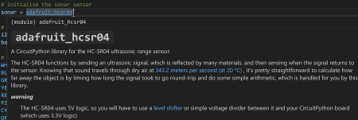

# Welcome to CircuitPython Sync

The purpose of this extension is to provide developers using Adafruit's CircuitPython (CP) on microcontrollers with tools for efficient CP coding, uploading, and monitoring during development.  The model used by this extension is for code and library files to reside on the storage of the development workstation with tools for synchronizing application assets with the attached board. This model is primarily intended to keep development assets in source control while ensuring the microcontroller storage is kept in sync. Having code assets on the workstation also allows VS Code to efficiently leverage python language services like auto-completion and intellisense in conjunction with CircuitPython language and library "stubs" managed by the extension. There are other excellent VS Code extensions and alternate IDEs that use a model having the workstation directly edit files on the CircuitPython drive should you prefer not to use the source-control-first methodology.

To return to this help file while using the extension run the `Welcome and Help` command, or click on one of the help icons in the title bar of many of the commands.

## Table of Contents ##
* [Getting Started](#getting-started)
* [Toolbar and Board Explorer](#toolbar-and-board-explorer)
* [CircuitPython Language Support](#circuitpython-language-support)
* [CP Drive Mapping](#cp-drive-mapping)
* [Library Support](#library-support)
* [Board Support](#board-support)
* [Libs Copy Support](#libs-copy-support)
* [Files Copy Support](#files-copy-support)
* [Project Template Support](#project-template-support)
* [Board Downloading](#board-downloading)
* [Project Bundle Support](#project-bundle-support)

## Getting Started

The extension activates when a workspace is opened containing `code.py` or `main.py` python files and/or a folder for libraries named `lib` or `Lib`.  You can also manually start the extension (for instance in a blank workspace or where you have just created a python file) by running any of the commands, including `Welcome and Help` to show this file or one of the startup helpers like [Project Templates](#project-template-support) or [Project Bundles](#project-bundle-support).

For a simple application, create a code file (typically `code.py`), connect your board to a usb port on your workstation, map the CircuitPython drive using the [CP Drive Mapping](#cp-drive-mapping) command, and use the `Copy Files` command to push the code file to the board.  Then you can monitor and debug the application on the board using the VS Code built-in Serial monitor, making modifications and re-pushing to the board.

For more complicated applications that use sensors and other hardware you can add libraries with the extension [Library Support](#library-support) for Adafruit libraries, or add other 3rd party libraries as needed.  Library files have a dedicated `Copy libs` command as well as offering intellisense through Adafruit published definition files downloaded by the extension (which also includes all the built-in modules in CircuitPython).  You can also select the type of connected board to leverage the extension [Board Support](#board-support) feature, giving auto-completion and validation of board definitions such as pins available, for example.  The remainder of this help file gives details on all the commands and features of the extension.

One of the key ways in which the extension "protects" the integrity of your project is through extensive use of the VS code settings system. The extension saves CP and library bundle versions in the VS Code workspace settings along with board model and mapping settings.  When the settings are committed to source control you can then pull the repo down to any workstation and your project will be in the same state as last time you pushed to your repo.  Also, the extension will manage in-workspace copies of library and CP bundles which can optionally be included in your repo push, making it even faster to restore your project and get back to coding.  

[Top](#welcome-to-circuitpython-sync)

## Toolbar and Board Explorer

There are several visual tools offered by the extension that support the development workflow.  The first is a toolbar consisting of 4 command/status buttons in the lower status bar of VS Code (usually toward the left side).  
The buttons show status through icons and also tooltips for issues and settings.


From left to right the buttons are:
* **Copy Files to board.**  The icon to the right of the arrow shows whether a valid board connection exists, augmented by a tool tip explaining the condition.  The button will also "light up" with a contrasting color when files are ready to be copied, such as after editing.  Clicking the button copies the files to the board if connected.  The files that are copied are either the default `code.py` or `main.py`, or a configured set using the command detailed below in [Files Copy Support](#files-copy-support).
* **Copy Libraries to board.** Similar to the Files Copy, status is indicated by icons and a tooltip.  The button lights up if new libraries are added or libraries are removed.  Clicking the button copies either all the libraries under the Lib folder or those configured using the command detailed in [Libs Copy Support](#libs-copy-support).
* **Map CP Drive.** Clicking this runs the command detailed in [CP Drive Mapping](#cp-drive-mapping).  The tooltip on the button shows the current mapping, if any.
* **Select CP Board Type.**  Clicking this button brings up a list for choosing one CircuitPython qualified board model to support intellisense and validation during code development.  More details can be found below at [Board Support](#board-support).  The tooltip on the button shows the currently chosen board type.

A companion tool called the Board Explorer shows a tree view of the contents of the CircuitPython drive if connected.  By default the tool shows up in the Primary sidebar explorer views (usually on the left side).


Note that there are some action buttons that only show up when you float your mouse over the `BOARD EXPLORER` title.  However, the explorer is generally more useful if you open the secondary sidebar and drag the explorer to one of the tabs; the action buttons show up without needing to mouse over.


In addition to showing the files and folders on the mapped board, the explorer enables file deletion (right click on a file), opening the drive in the operating system (file explorer on Windows, Finder on MacOS, terminal on Linux), and the view refreshed when changes occur outside the extension.  The board files can also be downloaded to your workspace with various options as detailed in [Board Downloading](#board-downloading).

[Top](#welcome-to-circuitpython-sync)

## CircuitPython Language Support

VS Code provides first-class python coding tools through the Microsoft-provided Python extensions Python and Pylance (these will be installed when you install this extension if you don't have them.)  These offer formatting, linting, intellisense, etc. for the Python language real-time during coding.  For example, if you fail to indent the first line after a def statement:


This extension adds support for CircuitPython-specific built-in modules and libraries by downloading the latest CircuitPython bundle from Adafruit and extracting the built-in modules and libraries into a folder in your workspace.   The extension then configures the python language services to use these folders as part of the python path, enabling intellisense and validation for all the built-in modules and libraries.

For example, using the built-in alarm module for sleeping will auto-complete the types of alarms available:


If you are working with a sensor supported by a library in the standard bundle, the properties and methods of the library will also be available for auto-completion:  


Details of the library are also available in the hover tooltip:



The extension also downloads the latest CircuitPython board definition files from Adafruit and extracts them into a folder in your workspace.  The extension then configures the python language services to use these folders as part of the python path, enabling intellisense and validation for all the built-in modules and libraries.  For example, pin definitions are available for auto-completion:


Details of the board are also available in the hover tooltip:


While highly recommended, the CircuitPython language support is not required for the extension to support the basic workflow of copying files and libraries to the board.  More details on the CircuitPython language support can be found in the [Library Support](#library-support) and [Board Support](#board-support) sections below.

[Top](#welcome-to-circuitpython-sync)

## CP Drive Mapping

Configuring the attached board drive is a key step in the development workflow to enable code files and libraries to be uploaded to your board.  The drive set command can be run from the command palette or by clicking the `Map CP Drive` button on the toolbar.  The command will show a dialog with a list of available drives and a `Pick Manually` selection to select any file path.  The dialog will also show the current mapping if any.

The extension queries the operating system for available drives and shows them in the dialog.  The list includes any removable drives that have the `boot_out.txt` file in the root of the drive.  This file is created by CircuitPython when the board is connected to the workstation and is used by the extension to identify the drive as a potential CircuitPython drive.  Then the "most likely" board drive(s) (listed as Auto Detected) has a disk label of `CIRCUITPY`.  For example on Windows the mapping command may show:


Here the `D:` drive had the correct volume label, but an SD card mounted as the `F:` drive had a `boot_out.txt` file that had been used for testing.  In fact, any file directory can be selected by choosing the `Pick Manually` option and selecting a folder.  One use case for this feature is for making a copy of the development files and libraries on a removable drive and later copying to the board on a different workstation.

For MacOS and Linux, the selected drive path will show as something like `/Volumes/CIRCUITPY` or `/media/username/CIRCUITPY`.  In all cases the proper string will be saved in the workspace settings so that the extension can find the drive again when you open the workspace.

[Top](#welcome-to-circuitpython-sync)

## Library Support

Many CircuitPython applications use libraries to support the hardware and sensors used in the application.  For example, the following illustrates a simple application using a popular sonar distance sensor:


Since the CP runtime on boards is opinionated to use a folder in the root named `lib` or `Lib` for libraries, the extension uses the same folder name in the workspace to hold the libraries.  Libraries may be single files or folders containing multiple files.  They may be sourced from the official Adafruit CircuitPython bundle or from other sources such as the community bundle.  This extension can currently automatically download the Adafruit CP bundle; however, any CP compatible library can be used by copying the files/folders into the `lib` folder.  Then the `Copy Libs to Board` command will copy the libraries to the board.

Automated handling of the Adafruit bundle is initiated by running the `Install or Update Libraries and Stubs`command (this will be prompted during startup if a lib folder exists but the archive has not been created).  This command will download the latest bundle (or a specified version) from Adafruit into an archive folder in your workspace, as shown in this example:


For any libraries that are in the `lib` folder (or that are copied in later), the extension will extract plain text `.py` versions from the bundle files and place them in a `libstubs` folder in the lib archive folder.  Then the extension configures the python language services to use these folders as part of the python path, enabling intellisense and validation for all the the libraries being used.  For example, the configuration in settings.json might look like:

```json
"python.analysis.extraPaths": [
        "c:\\myuser\\myprojects\\simpleCp\\libArchive\\libstubs",
    ]
```

The `.py` files in the `libstubs` folder are used for intellisense and validation only; the standard bundle files are compressed/compiled `.mpy` files in the `lib` folder used by the CP runtime. Note that if you have a custom or other 3rd party library in the `lib` folder that is in `.py` format, you can add another path to the `python.analysis.extraPaths` setting to enable intellisense and validation for that library as well.  Just use the path to the `lib` folder itself; Pylance will ignore the `.mpy` files and just search for `.py` files.

Once the library support has been installed the `Select Libraries` command will add and/or remove libraries sourced from the standard bundle.  Added libraries will be copied to the `lib` folder with `.py`' versions updated in the `libstubs` folder; removed libraries will be deleted from the `lib` folder and the `libstubs` folder.  The command will also add any dependency libraries needed by the selected libraries; this is based on metadata downloaded with the chosen release version of the bundle.

The `Install or Update Libraries and Stubs` also downloads "stubs" for the CircuitPython built-in modules and board definitions.  This is further described in the following section on Board Support.

[Top](#welcome-to-circuitpython-sync)

## Board Support

help text 4

help text 4

help text 4

help text 4

help text 4

help text 4

help text 4

help text 4

help text 4

[Top](#welcome-to-circuitpython-sync)

## Libs Copy Support

help text 5

help text 5

help text 5

help text 5

help text 5

help text 5

help text 5

help text 5

help text 5

[Top](#welcome-to-circuitpython-sync)

## Files Copy Support

help text 6

help text 6

help text 6

help text 6

help text 6

help text 6

help text 6

help text 6

help text 6

[Top](#welcome-to-circuitpython-sync)

## Project Template Support

help text 7

help text 7

help text 7

help text 7

help text 7

help text 7

help text 7

help text 7

help text 7

[Top](#welcome-to-circuitpython-sync)

## Board Downloading

help text 9

help text 9

help text 9

help text 9

help text 9

help text 9

help text 9

help text 9

help text 9

[Top](#welcome-to-circuitpython-sync)

## Project Bundle Support

help text 10

help text 10

help text 10

help text 10

help text 10

help text 10

help text 10

help text 10

help text 10

[Top](#welcome-to-circuitpython-sync)

