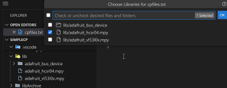

# Welcome to CircuitPython Sync

The purpose of this extension is to provide developers using Adafruit's CircuitPython (CP) on microcontrollers with tools for efficient CP coding, uploading, and monitoring during development.  The workflow supported by this extension is for code and library files to reside on the storage of the development workstation with tools for synchronizing application assets with the attached board. This model is primarily intended to keep development assets in source control while ensuring the microcontroller storage is kept in sync. Having code assets on the workstation also allows VS Code to efficiently leverage python language services like auto-completion and intellisense in conjunction with CircuitPython language and library "stubs" managed by the extension. There are other excellent VS Code extensions and alternate IDEs that use a model having the workstation directly edit files on the CircuitPython drive should you prefer not to use the source-control-first methodology.

**New in Version 2**. Support has been added for boards that don't have native USB support, that is, that don't mount a "CIRCUITPY" drive when connected to the workstation USB port. These boards can be used with the extension by leveraging a serial port connection to upload code and libraries as well as monitor the application output.  See the [Serial Port Support](#serial-port-support) section below for more details.

To return to this help file while using the extension run the `Welcome and Help` command, or click on one of the help icons in the title bar of many of the commands.

## Table of Contents ##
* [Getting Started](#getting-started)
* [Toolbar and Board Explorer](#toolbar-and-board-explorer)
* [CircuitPython Language Support](#circuitpython-language-support)
* [CP Drive Mapping](#cp-drive-mapping)
* [Library Support](#library-support)
* [Board Support](#board-support)
* [Libs Copy Support](#libs-copy-support)
* [Files Copy Support](#files-copy-support)
* [Project Template Support](#project-template-support)
* [Board Downloading](#board-downloading)
* [Project Bundle Support](#project-bundle-support)
* **NEW - V2** [Using the Serial Monitor and New Serial Terminal](#using-the-serial-monitor-and-new-terminal)
* [Uploading Circuit Python Firmware UF2](#uploading-uf2)
* **NEW - V2** [Serial Port Support](#serial-port-support)

## Getting Started

The extension activates when a workspace is opened containing `code.py` or `main.py` python files and/or a folder for libraries named `lib` or `Lib`.  You can also manually start the extension (for instance in a blank workspace or where you have just created a python file) by running any of the commands, including `Welcome and Help` to show this file or one of the startup helpers like [Project Templates](#project-template-support) or [Project Bundles](#project-bundle-support).

For a simple application, create a code file (typically `code.py`), connect your board to a usb port on your workstation, map the CircuitPython drive (or in **V2** Connect and mapping a serial port) using the [CP Drive Mapping](#cp-drive-mapping) command, and use the `Copy Files` command to push the code file to the board.  Then you can monitor and debug the application on the board using the VS Code built-in Serial monitor or the extension's own Serial Terminal, making modifications and re-pushing to the board.

For more complicated applications that use sensors and other hardware you can add libraries with the extension [Library Support](#library-support) for Adafruit libraries, or add other 3rd party libraries as needed.  Library files have a dedicated `Copy libs` command as well as offering intellisense through Adafruit published definition files downloaded by the extension (which also includes all the built-in modules in CircuitPython).  You can also select the type of connected board to leverage the extension [Board Support](#board-support) feature, giving auto-completion and validation of board definitions such as pins available, for example.  The remainder of this help file gives details on all the commands and features of the extension.

One of the key ways in which the extension "protects" the integrity of your project is through extensive use of the VS code settings system. The extension saves CP and library bundle versions in the VS Code workspace settings along with board model and mapping settings.  When the settings are committed to source control you can then pull the repo down to any workstation and your project will be in the same state as last time you pushed to your repo.  Also, the extension will manage in-workspace copies of library and CP bundles which can optionally be included in your repo push, making it even faster to restore your project and get back to coding.  

[Top](#welcome-to-circuitpython-sync)

## Toolbar and Board Explorer

There are several visual tools offered by the extension that support the development workflow.  The first is a toolbar consisting of 4 command/status buttons in the lower status bar of VS Code (usually toward the left side). The buttons show status through icons and also tooltips for issues and settings. **NEW in V2**. The toolbar includes a button to select and connect a serial port for boards that don't have native USB support. 


From left to right the buttons are:
* **Copy Files to board.**  The icon to the right of the arrow shows whether a valid board connection exists, augmented by a tool tip explaining the condition.  The button will also "light up" with a contrasting color when files are ready to be copied, such as after editing.  Clicking the button copies the files to the board if connected.  The files that are copied are either the default `code.py` or `main.py`, or a configured set using the command detailed below in [Files Copy Support](#files-copy-support).
* **Copy Libraries to board.** Similar to the Files Copy, status is indicated by icons and a tooltip.  The button lights up if new libraries are added or libraries are removed.  Clicking the button copies either all the libraries under the Lib folder or those configured using the command detailed in [Libs Copy Support](#libs-copy-support).
* **Map CP Drive.** Clicking this runs the command detailed in [CP Drive Mapping](#cp-drive-mapping).  The tooltip on the button shows the current mapping, if any.
* **Select CP Board Type.**  Clicking this button brings up a list for choosing one CircuitPython qualified board model to support intellisense and validation during code development.  More details can be found below at [Board Support](#board-support).  The tooltip on the button shows the currently chosen board type.
* **Serial Port Status and Commands**.  This shows the current state of connection to a board serial port and provides a one click activation of the connect and disconnect commands as detailed in [Serial Port Support](#serial-port-support).

### Board Explorer

A companion tool called the Board Explorer shows a tree view of the contents of the CircuitPython drive if connected.  By default the tool shows up in the Primary sidebar explorer views (usually on the left side).


Note that there are some action buttons that only show up when you float your mouse over the `BOARD EXPLORER` title.  However, the explorer is generally more useful if you open the secondary sidebar and drag the explorer to one of the tabs; the action buttons show up without needing to mouse over.


In addition to showing the files and folders on the mapped board, the explorer enables actions: deleting a file from the board (right click on a file); downloading a single file to your workspace (right click on a file); opening the drive in the operating system (file explorer on Windows, Finder on MacOS, terminal on Linux); and refreshing the view when changes occur outside the extension.  The board files can also be downloaded to your workspace with various options as detailed in [Board Downloading](#board-downloading).

While not directly accessible from the explorer, there is a companion command that compares a file in the workspace with the same file on the board.  This is useful for checking if a file has been modified on the board or in the workspace.  The command is `Compare File to Board` and can be run from the command palette or by right-clicking on a file in the explorer.  Note that if the workspace file is not found on the board BUT the file is mapped to a filename that is on the board (see [Files Copy Support](#files-copy-support)), the command will ask if you want to compare the two files.

**NEW in V2**. The Board Explorer now supports boards connected via serial port (see [Serial Port Support](#serial-port-support)).  When a serial port is connected and the `serialfs:` drive is mapped (see [CP Drive Mapping](#cp-drive-mapping)), the explorer will show the files and folders on the connected board.  Most of the same actions are supported as with a standard CircuitPython drive; however, the `Open in OS` option is disabled since the serial "drive" is virtual within the extension only:


Version 2 also adds two new features to the board explorer:
* Ability to delete folders on the board by right-clicking the folder and choosing delete:

    

    The folder must be empty so delete any files or sub-folders within a folder to be able to delete:

    

* Retrieving the file size from a file on the board through the right-click menu:

    

[Top](#welcome-to-circuitpython-sync)

## CircuitPython Language Support

VS Code provides first-class python coding tools through the Microsoft-provided Python extensions Python and Pylance (these will be installed when you install this extension if you don't have them.)  These offer formatting, linting, intellisense, etc. for the Python language real-time during coding.  For example, if you fail to indent the first line after a def statement:


This extension adds support for CircuitPython-specific built-in modules and libraries by downloading the latest CircuitPython bundle from Adafruit and extracting the built-in modules and libraries into a folder in your workspace.   The extension then configures the python language services to use these folders as part of the python path, enabling intellisense and validation for all the built-in modules and libraries.

For example, using the built-in alarm module for sleeping will auto-complete the types of alarms available:


If you are working with a sensor supported by a library in the standard bundle, the properties and methods of the library will also be available for auto-completion:  


Details of the library are also available in the hover tooltip:


The extension also downloads the latest CircuitPython board definition files from Adafruit and extracts them into a folder in your workspace.  The extension then configures the python language services to use these folders as part of the python path, enabling intellisense and validation for all the built-in modules and libraries.  For example, pin definitions are available for auto-completion:


Details of the board are also available in the hover tooltip:


While highly recommended, the CircuitPython language support is not required for the extension to support the basic workflow of copying files and libraries to the board.  More details on the CircuitPython language support can be found in the [Library Support](#library-support) and [Board Support](#board-support) sections below.

[Top](#welcome-to-circuitpython-sync)

## CP Drive Mapping

Configuring the attached board drive is a key step in the development workflow to enable code files and libraries to be uploaded to your board.  The drive set command can be run from the command palette or by clicking the `Map CP Drive` button on the toolbar.  The command will show a dialog with a list of available drives and a `Pick Manually` selection to select any file path.  The dialog will also show the current mapping if any.

The extension queries the operating system for available drives and shows them in the dialog.  The list includes any removable drives that have the `boot_out.txt` file in the root of the drive.  This file is created by CircuitPython when the board is connected to the workstation and is used by the extension to identify the drive as a potential CircuitPython drive.  Then the "most likely" board drive(s) (listed as Auto Detected) has a disk label of `CIRCUITPY`.  For example on Windows the mapping command may show:


Here the `D:` drive had the correct volume label, but an SD card mounted as the `F:` drive had a `boot_out.txt` file that had been used for testing.  In fact, any file directory can be selected by choosing the `Pick Manually` option and selecting a folder.  One use case for this feature is for making a copy of the development files and libraries on a removable drive and later copying to the board on a different workstation.

For MacOS and Linux, the selected drive path will show as something like `/Volumes/CIRCUITPY` or `/media/username/CIRCUITPY`.  In all cases the proper string will be saved in the workspace settings so that the extension can find the drive again when you open the workspace.

**NEW in V2**. When a serial port is connected (see [Serial Port Support](#serial-port-support)), a special "virtual" drive is available that enables file activity to the connected board.  This virtual drive is named `serialfs:` and shows up in the drive mapping like:


Disconnecting the serial port automatically un-maps this drive.  If the `serialfs:` drive is left mapped when the workspace is closed, a modal dialog will be shown when the workspace is re-opened:


If the 'Yes' button is chosen the Serial Port Connection command will come up; if a port is connected the `serialfs:` drive will be connected.

The drive select option dialog has a shortcut button to the Serial Port Connection command:


This will run the serial port connection command and, if the `serialfs:` drive is not already connected, return to the drive select dialog.  Otherwise the `serialfs:` drive will be retained without re-running the drive select command.  The board explorer will also be refreshed to reflect the new port connection.


[Top](#welcome-to-circuitpython-sync)

## Library Support

Many CircuitPython applications use libraries to support the hardware and sensors used in the application.  For example, the following illustrates a simple application using a popular sonar distance sensor:


Since the CP runtime on boards is opinionated to use a folder in the root named `lib` or `Lib` for libraries, the extension uses the same folder name in the workspace to hold the libraries.  Libraries may be single files or folders containing multiple files.  They may be sourced from the official Adafruit CircuitPython bundle or from other sources such as the community bundle.  This extension can currently automatically download the Adafruit CP bundle; however, any CP compatible library can be used by copying the files/folders into the `lib` folder.  Then the `Copy Libs to Board` command will copy the libraries to the board.

Automated handling of the Adafruit bundle is initiated by running the `Install or Update Libraries and Stubs`command (this will be prompted during startup if a lib folder exists but the archive has not been created).  This command will download the latest bundle (or a specified version) from Adafruit into an archive folder in your workspace, as shown in this example:


The `Install or Update Libraries and Stubs` command allows you to specify the version of CircuitPython and a particular library bundle version, or the latest of each.  For CP you can specify the major version (such as 9), the complete version (such as 9.2.5), or just leave the field blank for the latest.  For the library bundle you can specify the full version (such as 20250725) or blank for the latest for the selected version of CP (for older releases, the last bundle version available for that version). NOTE that the extension may not be able to find the last library bundle for CP versions older than the last few (for example, version 7), in which case an error will be given. 

For any libraries that are in the `lib` folder (or that are copied in later), the extension will extract plain text `.py` versions from the bundle files and place them in a `libstubs` folder in the lib archive folder.  Then the extension configures the python language services to use these folders as part of the python path, enabling intellisense and validation for all the the libraries being used.  For example, the configuration in settings.json might look like:

```json
"python.analysis.extraPaths": [
        "c:\\myuser\\myprojects\\simpleCp\\libArchive\\libstubs",
    ]
```

The `.py` files in the `libstubs` folder are used for intellisense and validation only; the standard bundle files are compressed/compiled `.mpy` files in the `lib` folder used by the CP runtime. Note that if you have a custom or other 3rd party library in the `lib` folder that is in `.py` format, you can add another path to the `python.analysis.extraPaths` setting to enable intellisense and validation for that library as well.  Just use the path to the `lib` folder itself; Pylance will ignore the `.mpy` files and just search for `.py` files.

Once the library support has been installed the `Select Libraries` command will add and/or remove libraries sourced from the standard bundle.  Added libraries will be copied to the `lib` folder with `.py`' versions updated in the `libstubs` folder; removed libraries will be deleted from the `lib` folder and the `libstubs` folder.  The command will also add any dependency libraries needed by the selected libraries; this is based on metadata downloaded with the chosen release version of the bundle.

The `Install or Update Libraries and Stubs` also downloads "stubs" for the CircuitPython built-in modules and board definitions.  This is further described in the following section on Board Support.

[Top](#welcome-to-circuitpython-sync)

## Board Support

The extension offers language support for specific board definitions as well as the CircuitPython board runtime built-in modules.  It does this by downloading "stubs" for the version of CP specified in the `Install or Update Libraries and Stubs` command or previously saved in the workspace settings.  These stubs are `.pyi` interface files (vs the entire source code) that are used by the python language services to provide intellisense and validation for the built-in modules and board definitions.  The downloaded compressed stubs are saved in a `stubArchive` folder in the workspace to preserve the version of the stubs used for the project; you can choose to include this folder in your source control repo, if not it can be re-downloaded when the repo is next pulled down.  The uncompressed stub directory is extracted to a global cache provided by VS Code; the directory can be somewhat large and you would not need to include it in your workspace.  The extension configures the python language services to use these folders as part of the python path, enabling intellisense and validation for all the built-in modules and libraries.  For example, the configuration in settings.json might look like:

```json
    "python.analysis.extraPaths": [
        "c:\\user-app-data\\globalStorage\\extensionname\\stubs\\circuitpython_stubs-9.2.7"
    ]
```

This enables language support for CP built-ins, such as `digitalio`, `analogio`, etc.  It also contains support for the basic `board` module with functions such as `I2C`, `SPI`, etc. common to all boards.  To get support for specific boards, run the `Select Board` toolbar button or command and choose from the list of boards supported in the version of CP you chose in the `Install or Update Libraries and Stubs` command.  

```json
    "python.analysis.extraPaths": [
        "c:\\user-app-data\\globalStorage\\extensionname\\stubs\\circuitpython_stubs-9.2.7\\board_definitions\\adafruit_feather_esp32s2",
    ],
```

With this path pointing to the selected board definition folder, you will get intellisense and validation for the board definition.  For example, the `board` module will have all the pins available for the selected board.

With all of the python extraPaths noted in this and the last section, a typical settings section might look like:

```json
    "python.analysis.extraPaths": [
        "c:\\user-app-data\\globalStorage\\extensionname\\stubs\\circuitpython_stubs-9.2.7",
        "c:\\user-app-data\\globalStorage\\extensionname\\stubs\\circuitpython_stubs-9.2.7\\board_definitions\\adafruit_feather_esp32s2",
        "c:\\myuser\\myprojects\\simpleCp\\libArchive\\libstubs",
    ]
```

Note that while the paths are specific to the workstation or remote server being used for development, the extension will automatically update the paths in the settings file if you change the workspace location or move the project to a different workstation.


[Top](#welcome-to-circuitpython-sync)

## Libs Copy Support

As noted in the Toolbar section above the extension provides a `Copy Libs to board` command that copies some or all of the files and folders in the `lib` folder to the board mapped drive.  If you need all the libraries copied to the board, no other configuration is needed.  Any newly selected libraries will also be copied to the board.  There are scenarios where a subset of the libraries in the `lib` folder need to be copied.  For example, during prototyping several different sensors may be used with different libraries involved.  While normally copying different libraries for similar sensors to a board is not an issue, there can be conflicts such as versions of dependencies and storage space.  This extension offers the `Manage Libs Copy` command to craft a copy manifest that can be used to enable selective copy of the contents of the libraries folder.  

The default filename of the manifest file is `cpfiles.txt`, but this can be changed in settings.  The file is located in the `.vscode` folder in the workspace.  The file is a simple text file with one line per library to be copied.  When executing the copy command the extension will check the `lib` folder for the libraries listed in the manifest and copy them to the board.  If a library is not found, it will be skipped.  If the file is missing or no libraries are listed, the extension will copy all the libraries in the `lib` folder.  The manifest file is not required for the extension to work; it is only used if you want to limit the libraries copied to the board.  The file is also used to tailor file copies (see the next section).

An example of using the manifest file is choosing between a sonar sensor or a time of flight sensor during prototyping.  The `Manage Libs Copy` command shows all libraries in the `lib` folder, but then you can deselect those you are not working with at a point during development, like:



which results in a manifest file like:


Then when you are ready to try the other sensor you can reverse the selections.  The Copy Libs command clears out any prior libraries on the board that are not included in the current copy.  As an alternative, the extension supports commenting out lines by editing the manifest file:


which results in the same selections in the command:


The commenting feature makes it a bit quicker to flip back and forth between library sets.

After your library copy set is configured, the selected files/folders that will be copied are decorated with a color and a "CP" badge in the explorer view, while the `lib` folder itself is decorated with a bubble badge and color:


If no specific libraries are selected to be copied, the entire `lib` folder will be copied and the `lib` folder itself will be decorated with a color and a "CP" badge:


[Top](#welcome-to-circuitpython-sync)

## Files Copy Support

The `Manage Files Copy` command is similar to the `Manage Libs Copy` command, but it is used to manage the non-library files copied to the board. The copy logic is similar to the library copy: if `cpfiles.txt` is missing or has no non-library files, only the main python files (`code.py` or `main.py`) will be copied.  The command lets you select from all the possible files that can be copied:


The resulting manifest file will then look like:


The commenting feature noted above for libraries also works for the files copy settings.  There is an additional feature that copies a file from the workspace to a different filename on the board.  This is useful if you have several versions of a file you are testing (for example `code1.py` and `code2.py`) and you want to copy one of them to the board as `code.py` or `main.py`.  The syntax is shown below with a `->` chord between the source and destination filenames.  You can then use the commenting feature to select which source file to copy:


Note that unlike the library copy, the files copy does not clear out any prior files on the board that are not included in the current copy manifest.  You can use the board explorer to delete files as noted in prior sections.

As with the library copy support, files that are currently configured to be copied by the copy files button will be decorated with a color and a "CP" badge:


If the file copy manifest has no non-library files the default `code.py` or `main.py` will be decorated.  When any of the decorated files is opened the editor tab will also show the decoration.  Note that higher priority decorations such as an error indication (normally red) or source control status will fully or partially override the copy decoration.

The file copy manifest can also handle folders with application specific files.  The folder and files will show up in the pick list of the `Manage Files Copy` command, for example: 


Note that as with the library copy support, a folder with files selected for copy will have the bubble badge and color decoration, with the files having the CP badge and color.  Certain system level folders are excluded from the command pick list, such as `.vscode` and `.git`.

**NEW in V2**.  The feature to rename a file during copy has been augmented with an ability to re-root a file.  For example, suppose you have a folder in your workspace with several test versions of code.py:


Note that the destination of the `code-test1.py` file has a leading "/".  This causes the file to be placed at the root of the board versus creating a folder called "code_tests" with the code.py:


This can be contrasted with the file copied from the "extras" folder into the same folder on the board.  Similarly if the `temp1.txt` file was to be renamed during the copy, but no leading slash was found it would still go into the "extras" folder on the board.


During the work on the re-rooting feature a bug was fixed where the compare feature (noted in [Toolbar and Board Explorer](#toolbar-and-board-explorer)) did not always follow the mapping in `cpfiles.txt`.  Additionally the compare also picks up the new re-rooting mapping.

[Top](#welcome-to-circuitpython-sync)

## Project Template Support

As noted in the [Getting Started](#getting-started) section, the extension offers a method to create a new project or add features to an existing project using the `Make or Update Project from Templates` command.  Templates are plain text files with file-path delimited sections containing file contents.  A default template is included with the extension but you can create your own templates and apply them with the command.  The command will initially look like:


The "Apply Template" section highlighted in green shows the actions that can be done using the template noted in the placeholder above as `(from default)`, indicating the actions will use the default template.  The "Templates" section highlighted in yellow accesses a sub-command to pick a different template or manage your list of templates.  The last selection in the "Templates" section lets you view the currently selected template; this is also the way you can copy existing templates to make a new one. (An example of a template is shown below.)

The three actions available in the "Apply Template" section are:

*  **All files...** - this will copy all the files in the template to the workspace.  This is useful for creating a new project from scratch or adding specific files or settings to an existing project.  A warning with a cancellation option will be shown if any of the files already exist in the workspace; settings are always merged.
*  **Merge settings...** - this only merges settings from the template into the workspace settings.
*  **Add Sample Files...** - basically the same as the first option, but if a template file exists in the workspace the file will be copied in but with `.sample` added as an extension.

In the "Templates" section, the "Choose different template..." option will show a list of your available templates along with an option to return to the default template.  When a template is chosen the main command is shown again with the new template name in the placeholder.


As seen in this illustration, you can save your own templates in one of several locations:
* **Local file path** - the template must be plain text; it should have a helpful filename with a `.txt` extension.  While the template can be in the workspace (a sub-folder is recommended), the path saved is absolute; if the repo is restored to a different folder or another workstation the reference will need to be deleted and re-added (see below).
* **Private GitHub repo or gist** - If you have your GitHub account saved in VS Code you can save your custom template as a text file in one of your repos or as a gist.  The file should have a helpful filename and a `.txt` extension.  Be sure to use the raw link to the file when adding to your list.  Note that public repos and gists are also supported.
* **Public website** - the same as above, but the file must be available with no authentication required.  This is useful for sharing templates with others.

When the "Add new template..." option is selected in the "Choose personal template" command, another sub-command comes up which allows you to add new files or URL's, or remove existing ones.


You can add as many new entries as you have templates, then hit Escape to return to the "Choose personal template" command.  This command is also available in the command palette as `Manage Templates`.  The list of available templates is saved in your user settings, not the workspace since you often want to start a new project with a blank workspace.

As noted above, the format of a template file is a stream of text with file-path delimited sections.  File paths start with `>>>` at the beginning of a line, followed by the relative path of the file.  A path with only a trailing `/` will create the folder.  All file content between the path delimiters must be plain text; it is not a recommended way to include library files, see [Library Support](#library-support) instead.  Some samples from the default template file is shown below:

```text
>>>code.py
#sample circuitpython main code file
import time

while True:
    print('hello circuitpython!')
    time.sleep(2)

>>>lib/

>>>settings.toml
# To auto-connect to Wi-Fi on enabled boards uncomment and enter correct info
#CIRCUITPY_WIFI_SSID="mywifissd"
#CIRCUITPY_WIFI_PASSWORD="mysecretpassword"

>>>.gitignore
# Sometimes it can be useful...

...


>>>.vscode/settings.json
{
    "python.languageServer": "Pylance",
    "python.analysis.diagnosticSeverityOverrides": {
        "reportMissingModuleSource": "none",
        "reportShadowedImports": "none"
    }
}
```
When "All Files..." action is run with this template selected the following occurs:
* The `code.py` file is created with the sample code in the workspace root folder.
* The `lib` folder is created in the workspace root folder.
* The `settings.toml` file is created in the workspace root folder. 
* The `.gitignore` file is created in the workspace root folder.  There are some example entries in the default template that are commented out but can be uncommented to tailer the commits to your repo.
* The `settings.json` file is created in the `.vscode` folder in the workspace if it does not exist (with the `.vscode` folder created if it does not yet exist).  If the file already exists, the settings in the template are merged with the existing settings.  The default template includes some recommended settings for CircuitPython development including explicit callout of the Pylance language server, and some settings that prevent warnings if your `code.py` filename overrides your default workstation python settings.

Templates can be handy to simply add settings, such as:

```text
>>>.vscode/settings.json
{
     "python.analysis.typeCheckingMode": "basic"
}
```
This tells the python language server to check for errors (by default only informational notices are given.).  This would, for example, give an error if you tried to use a pin on a board that doesn't have that pin in its definition.

[Top](#welcome-to-circuitpython-sync)

## Board Downloading

A utility command `Download Board` is provided to copy files and folders from an attached CP board to the workspace.  The command provides several options to tailor the download:


By default the command overwrites any existing files in the workspace with the same name.  If the option is turned off only non-conflicting files will be copied.  The "Skip Dot Files and Folders" skips artifacts that are created by the CP runtime such as `.fseventsd` and `.Trashes`.  These are generally not needed but can be retrieved by turning off this option.  Finally the "Download only standard folders" option will skip folders such as `System Volume Information` while retrieving the `lib` folder.  To use the command you must map the CP drive first.  

**NEW in V2**.  The Board Download command now supports downloading files from a board connected via serial port (see [Serial Port Support](#serial-port-support)).  When a serial port is connected and the `serialfs:` drive is mapped (see [CP Drive Mapping](#cp-drive-mapping)), the command will download files from the connected board.  The same options are available as with a standard CircuitPython drive.  This is a convenient way to clone a board that doesn't have native USB with a mapped drive support.

[Top](#welcome-to-circuitpython-sync)

## Project Bundle Support

The [Adafruit Learn site](https://learn.adafruit.com/) has thousands of excellent learn guides, many of which use CircuitPython.  Often the author will include a link to download a "project bundle" which is a zip file containing the code and libraries used in the project.  This extension provides a command, `Load Project Bundle` which makes it easy to download the bundle into your workspace and setup the project for development:


The URL for the download can be entered into the command input, or if you have already downloaded the file to your workstation just press enter and a file picker will come up.  To get the URL link, find the `Download Project Bundle` button in the article and right-click it:


Once the URL is entered or a local file is selected the zip file will be extracted to the root of your workspace.  Typically this has the code.py file and a `lib` folder with the libraries used in the project.  If the project bundle contains solutions for multiple versions of CircuitPython, the extension will prompt you to select which version you want to use.  Make sure to install that version of the CircuitPython runtime on your board.

The extension will then prompt to add some typical settings (basically just the settings and .gitignore from the default template as detailed above).  If the `lib` folder exists the extension will also prompt to install library and stub support: 


When the command downloads a bundle or uses a local file, it copies the file to a `projectBundleArchive` folder in the workspace.  This allows you to restore the project bundle files if you decide to start over.  If you enter the same URL again, the extension will let you use the saved file if desired:


The project bundle files often include a `README.txt` file with some additional information on the project.  In particular the version of CircuitPython used may be noted.  By default the extension will use the latest stable version of CircuitPython for libraries and stubs, but if it is an older learn guide you may need to switch back to previous versions based on the information in the README file.

[Top](#welcome-to-circuitpython-sync)

## Using the Serial Monitor and New Terminal

VS Code includes a built-in Serial Monitor that can be used to monitor the output of your CircuitPython application.  With a CP board plugged into the workstation, use the `View: Toggle Serial Monitor` command to open the Serial Monitor in the panel, usually at the bottom of the edit area:   


The serial port of the board is usually pre-selected when the monitor starts, but if not select from the list.  Most recent boards use 115200 as the baud rate but check your board documentation if that doesn't work.  When you click Start Monitoring the output from the CP program (or errors) will scroll below the monitor controls (you can expand the vertical size of the panel to display more data).  To pause the program use the function button pull-down at the bottom right to select `Ctrl-C`.  This will stop the program and give you a REPL prompt.  You can then enter commands to test your code or check the state of the board by typing into the message box to the left of the function pull-down.  To restart the program, use the function button pull-down again to select `Ctrl-D`.  The monitor will then show the output from the program again.  (NOTE that as of Version 2 of the extension the Serial Monitor is not automatically installed; you will need to install the `Serial Monitor` extension from the VS Code marketplace if you want to use it.)

The VS Code Serial Monitor is well supported and reliable.  The separate message area and function button pull-down are a bit different from most serial terminals.  If you prefer a more traditional serial terminal, you might try the following:
* For Mac OS and Linux, the `screen` command is a good option.  In VS Code, open a terminal in the panel and use, for example, `screen /dev/tty.usbmodemXXXX 115200` or `screen /dev/ttyACM0 115200` (you can list the /dev directory to find the port name).  Use `Ctrl-A` then `K` to exit the screen session.  Once the session connects you can use `Ctrl-C` to stop the program and get into the REPL, and `Ctrl-D` to restart it. 
* For Windows you will need to install a program.  Edward Wright has an excellent program specifically tailored for CircuitPython called "SimplySerial". It is available on GitHub at https://github.com/fasteddy516/SimplySerial.  Once installed, open a terminal panel in VS Code and run `ss` to start the program.  It should automatically find the port and start the monitor. 

**NEW in V2**.  To support boards that use a serial port for communications a dedicated serial terminal has been added to the extension.  This is needed because the extension has to "share" the serial communications with command like uploading with the terminal and the VSCode monitor would interfere with this activity.  While the extension is executing commands to the board it pauses the visible terminal activity until the command is done, typically leaving CP in REPL mode.

To open the terminal use the `CP Open CircuitPython Sync Terminal` command:


If the bottom panel is already open and a serial port is connected, you can also just add the CP sync terminal with the selector:


[Top](#welcome-to-circuitpython-sync)

## Uploading UF2

The [Circuit Python site](https://circuitpython.org/) has a wealth of information on choosing and uploading UF2 firmware to your microcontroller board.  In general, the process involves putting your board into bootloader mode to appear as a drive on your PC, and then copying the downloaded UF2 file to the board using your operating system file utilities. The board then automatically reboots as a drive ready for CP code.  This extension provides a command to select and load the CP firware to your board all from within VS Code. (Note that a workspace must be open although no files are required for this command.)

Running the `CP Upload UF2 Firmware` command executes the following steps:
1.  The command will first open an input box and attempt to determine the drive path of your board connected in bootloader mode.  See the Circuit Python Site for help in entering bootloader mode, but it is often done by "double-clicking" a Reset button or holding a Boot button will connecting the power.  The command waits for a bit looking for a drive that contains a special file, `INFO_UF2.TXT`, which contains some text information about the board.  If found the path is shown in the input box ready to accept.  If not, you can manually enter the drive path (such as `D:` or `/media/path`).  Once the path is verified the command proceeds to the next step.  You can also stop the searching for a drive just by starting to type a drive or path in the input box.
2.  The `INFO_UF2` file contains several text strings that can be used to identify the board model.  This next step will try to match the strings to the list of boards from the site (the list was downloaded in the background when the command starts up).  The strings from the file on the drive often don't exactly match a board description from the site, so usually a list of potential boards are given in a best-match order from a fuzzy search.  If your board is listed select it and the command will proceed to step 4.
3.  If your board is not listed in the prior step you can search manually through the list that was downloaded from the site.  In the pick list from the previous step click the magnifying glass on the title bar.  This brings up a text entry field where you can type search text and enter to accept.  This will bring up another pick list of matches from the site list where your board should be listed.  If not, you can ESC and try again.  Once you select your board the command will proceed to the next step.
4.  In this step a text input box will prompt for the version of Circuit Python you want to upload.  To get the latest version just use the Enter key, or type a full version number (like 9.2.8) and Enter.  Note that previous versions are not always available for every board; an error will be given if that version for the specified board is not available.  (Note that the version of the UF2 firmware chosen is not related to the library and stubs version detailed earlier in this document, but that may change in future releases.)
5.  In the final step the command will download the UF2 file for the specified board and version.  The file will be saved in the root of the workspace, at least temporarily.  A choice list will then be given: upload the file to the board and keep the UF2 file in the workspace; upload the file and delete from the workspace; or cancel the command, which will also keep the file in the workspace.  After the upload the board should reboot into the Circuit Python drive, which can then be connected using the other facilites in this extension.  Generally the UF2 file can be deleted after the upload but it can be useful to save in your project as a quick way to prepare boards for a project load (See Direct Load of UF2 file below).  If you are using source control and have applied the stock `.gitignore` file from the default template (see [Project Template Support](#project-template-support)), UF2 files are ignored in source control; just remove that line if you want to save the uf2 file in your repo.

### Direct Load of previously Downloaded UF2 File
If you have a previously downloaded UF2 file in your workspace, you can right click the file to upload it to a board in bootloader mode.


This provides a quick way to re-flash a board without going through the entire selection process again. The bootloader drive search in Step 1 above will be done, then a choice will be given to upload or cancel, with the details shown for the file to be uploaded and the model name ready from the drive info file.

### Serial Port UF2 Upload Not Supported
If the serial port drive is mapped to a board, the UF2 upload commands will be disabled since UF2 upload requires the board to be in bootloader mode (i.e., a drive mapped) and not connected via serial port.  Both the command palette and right-click upload options will be disabled in this case:


The best way to load CircuitPython firmware to a board that does not have native USB support is to refer to the instruction on the CircuitPython site for your specific board at [CircuitPython.org](https://circuitpython.org/downloads)

[Top](#welcome-to-circuitpython-sync)

## Serial Port Support

### NEW in V2

Some CircuitPython boards do not have native USB support, meaning they do not mount a "CIRCUITPY" drive when connected to the workstation USB port.  These boards can now be used with this extension by leveraging a serial port connection to upload code and libraries as well as monitor the application output.  This section describes how to setup and use serial port support in the extension.  You can also connect to your board serial port even though your board presents a CIRCUITPY drive; this can be useful if you want to use the new lightweight serial terminal support in the extension, as described in [Using the Serial Monitor and New Serial Terminal](#using-the-serial-monitor-and-new-terminal).  (NOTE: this extension does not support uploading UF2 firmware over serial; refer to the section [Uploading Circuit Python Firmware UF2](#uploading-uf2) and the CircuitPython site for instructions on how to do this for your specific board.)

1. Connect the USB port on your board to your workstation.  Depending on your board and operating system you may need to install drivers to get the serial port to show up.  Refer to your board documentation for details; the [CircuitPython site](https://circuitpython.org/downloads) also has helpful information for many boards. The serial mode of this extension can generally be used as an alternative to "Web workflow" referenced in the documentation and learn guides.  If your board has two connectors (such as some of the Espressif boards with UART and USB ports) make sure to use the USB port.

    To connect the extension to the serial port, use the `CP Connect to Board Serial Port` command from the command palette (or the `Serial Port Status and Commands` toolbar button). This will open a choice list of ports:

    

    The name of the port may vary depending on your operating system and board.  If you are not sure which port to use, disconnect the board and run the command again to see which port disappears from the list.  Click the desired port and an information message will show the connection and baud rate.  If you simply want to use the new serial terminal you can start it at this point.

2. To use the serial port as a board drive mapping, run the `CP Set Drive` command from the command palette or click the `Map CP Drive` button on the toolbar.  The choice list offered will now include the serial drive option:

    

    Selecting the `serialfs:/` drive will map the board for normal file operations like uploading code and libraries, as well as the view and functions available in the board explorer.  The new serial terminal can also be used to view board output and the REPL.  As noted in the section on the VSCode serial monitor it should not be used in this mode.`

3. When a serial port is connected the serial port connection command will show the actively connected port when run again:

    

    Note that the Active port cannot be selected again; an error will be shown.  Also if you have another board serial port connected this dialog can be used to switch between them: the previously connected port will be disconnected, the new one connected, and any `serialfs:` virtual drive mapping will be maintained.

4. When you are ready to close your workspace you can disconnect the serial port with the command `CP Disconnect from Board Serial Port`.  This will remove the `serialfs:/` drive mapping, remove the `serialfs:/` entry from the board mapping options, and leave the drive mapping empty.  However, you can just close the workspace, leaving the `serialfs:/` entry in the drive mapping configuration.  As noted in the section [CP Drive Mapping](#cp-drive-mapping) the next time the workspace is opened you will be prompted with an option to connect the serial port again and re-map the drive.

5. As noted above in the [CP Drive Mapping](#cp-drive-mapping) section there is a shortcut to steps 1 and 2 above through a button on the title bar of `CP Drive Select` command picker:

    

    When clicked the `Connect to Board Serial Port` command is run first, then the `CP Set Drive` command is run again.  If a valid serial port was connected the `serialfs:/` drive will be shown in the pick list for mapping as the selected drive.

If you don't need the serial port functionality of the extension it can be disabled through a setting:

`circuitpythonsync.disableSerialPort`

This can be set either by checking in the vscode settings UI or set to `true` in the settings.json file in your workspace.  If turned on the toolbar button, the serial connect button in the `CP Drive Select` command, as well as all the serial port and CP Sync Terminal commands will be hidden.  The setting defaults to `false`.


[Top](#welcome-to-circuitpython-sync)


